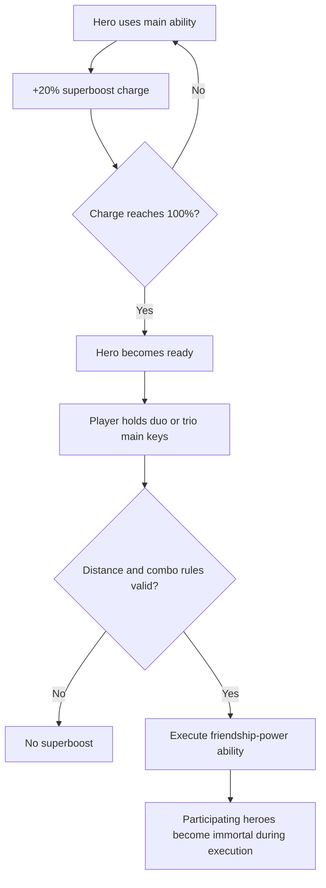
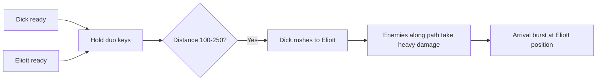
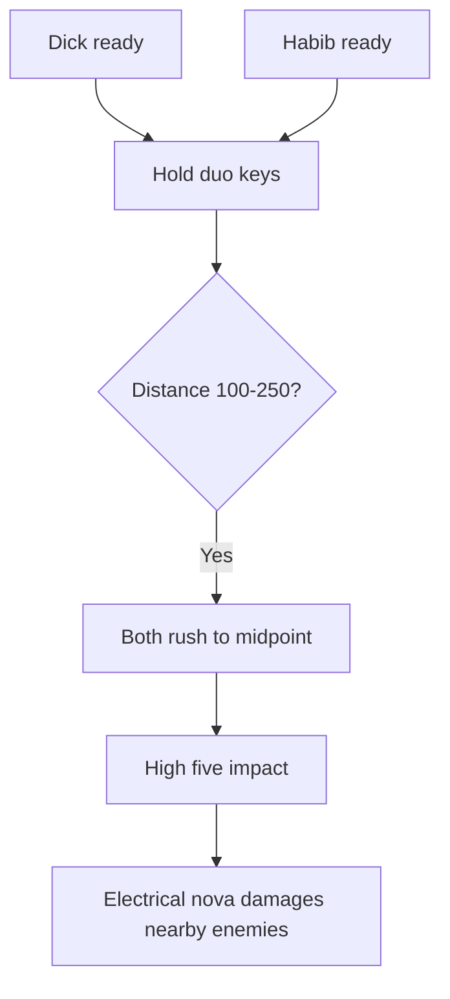
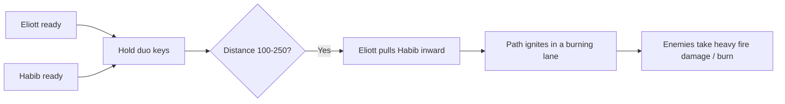
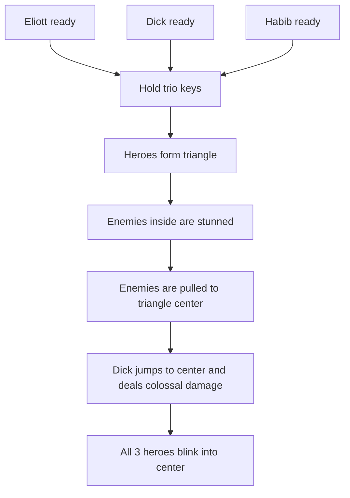
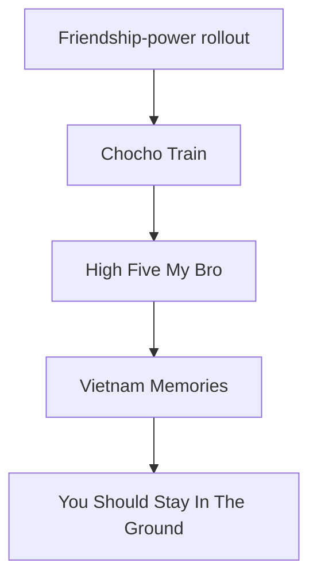

# Group Abilities

Date: 2026-05-17
Status: IMPLEMENTED (branch: group-abilities, 2026-05-17)

## Goal

Add friendship-power abilities that reward micro-control, spacing, and timing instead of keeping all three heroes permanently stacked as one blob.

These abilities are not normal skills. They are **group superboost abilities** charged by repeated use of each hero's regular main ability.

## Core System

Each hero charges their friendship-power meter by using their regular main ability:

- Eliott: `group_blink`
- Dick: `boomerang`
- Habib: `backdoor_blockade`

### Charge Rules

- Each use of a main ability grants about **20% superboost charge** to that hero.
- At 100%, that hero is considered **ready**.
- Group abilities require **2 ready heroes** for duo abilities.
- Later, rare trio abilities can require **3 ready heroes**.

### Activation Rules

- The player **presses and holds** the main ability keys of the required heroes.
- If the friendship-power conditions are met, the superboost is executed.
- During the full execution, the participating heroes are **immortal** and cannot die.

### Positioning Requirement

For duo friendship abilities to activate:

- the participating heroes must be **more than 100 px apart**
- and **less than 250 px apart**

This is the key anti-blob rule. The player must intentionally position heroes in relation to each other.

## Visual Direction

These abilities should feel bigger and more emotional than normal abilities.

Suggested visual language:

- a bright tether or friendship beam between the participating heroes before launch
- a large shared crest or duo icon drawn between them
- matching color trails while they move
- temporary screen tint unique to the pairing
- strong arrival burst or midpoint impact flash
- a short freeze-frame at the climax

### Cinematic Execution Layer

To make friendship-power abilities feel epic and memorable, each execution should briefly enter a more cinematic presentation mode:

- slight slow-down during the startup and impact window
- temporary camera zoom-in during the core action
- light screen shake on the strongest hit moment
- a brief hit-stop or freeze-frame at the climax

Suggested rhythm:

1. short anticipation pause while the link or formation appears
2. slight slow-motion during the travel or convergence
3. strongest zoom and shake at impact
4. quick return to normal gameplay readability

Important note:

- keep the effect strong enough to feel special
- but short enough that repeated use does not become annoying
- duo abilities should be cinematic
- trio abilities can be the most dramatic version of this system

Suggested color coding:

- Eliott + Dick: blue-white plus red-orange
- Dick + Habib: electric gold-white
- Eliott + Habib: green-white plus fire orange

## Favorite Shortlist

These are the strongest micro-control concepts from the session so far.

1. `Chocho Train` — Eliott + Dick
2. `High Five My Bro` — Dick + Habib
3. `Vietnam Memories` — Eliott + Habib
4. `You Should Stay In The Ground` — Eliott + Dick + Habib

The first four are now concrete enough to carry forward as the main friendship-power set.

## Duo Friendship Abilities

## `Chocho Train`

Heroes: **Eliott + Dick**

Theme: relocation into impact

### Short Description

Dick launches himself toward Eliott in a violent rush. Enemies around Dick during the charge path are heavily damaged, and the arrival creates an impact burst near Eliott.

### Detailed Gameplay Description

- Eliott and Dick must both have full superboost charge.
- The player holds the two relevant main ability keys.
- If Eliott and Dick are between **100 px and 250 px apart**, the ability activates.
- Dick rapidly dashes to Eliott's position.
- During the dash, Dick deals heavy physical damage in a circular area around himself as he travels.
- On arrival, a second burst of damage erupts around Eliott's position.
- Dick and Eliott are immortal during the sequence.

### Why It Creates Micro

- Dick wants to be offset from Eliott, not standing directly on him.
- The player is rewarded for lining up Dick's route through an enemy pack.
- Eliott becomes a target destination, so his position matters before activation.

### Gameplay Role

- gap closer
- line-breaker
- panic rescue if Dick is stranded
- dense-pack punishment

### Visuals

- a bright tether snaps from Dick to Eliott before launch
- Dick gains a train-like streak trail with sparks and dust
- enemies near the path are hit by circular shock pulses
- arrival creates a large flash ring centered on Eliott
- slight slow-motion during Dick's rush and a stronger shake on arrival

### Tuning Notes

- damage should be high enough to feel like a super, but not necessarily boss-deleting
- path radius can be medium so player cares about alignment
- arrival burst can add knockback to create breathing room

## `High Five My Bro`

Heroes: **Dick + Habib**

Theme: collision into electrical detonation

### Short Description

Dick and Habib sprint toward each other and collide in a high five. The impact releases a large electrical shock that damages enemies around the meeting point.

### Detailed Gameplay Description

- Dick and Habib must both have full superboost charge.
- The player holds the two relevant main ability keys.
- If Dick and Habib are between **100 px and 250 px apart**, the ability activates.
- Both heroes rush toward a midpoint between them.
- When they meet, they perform a dramatic high five.
- The contact point emits a strong electrical nova in a sizable radius.
- Enemies in the blast radius take significant damage and may also be briefly stunned or shocked.
- Dick and Habib are immortal during the sequence.

### Why It Creates Micro

- The player wants Dick and Habib spread with enemies between or around them.
- The midpoint matters, so this rewards deliberate spacing and angle setup.
- Habib is not only an anchor here; he becomes half of a collision mechanic.

### Gameplay Role

- anti-swarm burst
- anti-elite area shock
- formation reset tool
- strong emotional payoff move

### Visuals

- electric arcs build between Dick and Habib before they move
- both leave bright trails converging toward the same point
- the high five has a freeze-frame and giant radial flash
- branching lightning jumps outward after contact
- camera zoom peaks right before the high five connects

### Tuning Notes

- midpoint should be readable before execution, perhaps with a marker
- can include a short stun to distinguish it from `Chocho Train`
- electrical theme makes it a good candidate for stronger VFX and sound

## `Vietnam Memories`

Heroes: **Eliott + Habib**

Theme: pull-and-burn path execution

### Short Description

Eliott pulls Habib to himself, and the entire path between them erupts in fire, damaging enemies caught in the line.

### Detailed Gameplay Description

- Eliott and Habib must both have full superboost charge.
- The player holds the two relevant main ability keys.
- If Eliott and Habib are between **100 px and 250 px apart**, the ability activates.
- Eliott yanks Habib toward his position, similar in structure to pulling Dick in a friendship combo.
- As Habib travels, the ground between the two heroes burns in a wide fiery lane.
- Enemies touched by the lane take significant fire damage, potentially including a burn-over-time effect.
- Eliott and Habib are immortal during the sequence.

### Why It Creates Micro

- The player wants Eliott and Habib separated with enemies placed between them.
- It turns spacing into a weapon instead of just a requirement.
- Eliott acts as the connector while Habib acts as the destructive payload.

### Gameplay Role

- corridor clearer
- area denial
- burn setup for follow-up plays
- strong lane-control combo

### Visuals

- green-white pull energy from Eliott into Habib
- Habib leaves a burning trench as he slides
- flames linger briefly after the move
- ending burst can include smoke and cinders around Eliott
- the fire lane can be revealed with a brief dragging slow-mo moment

### Tuning Notes

- lane width should be generous enough to feel satisfying
- lingering fire is a good way to distinguish this from the other two
- can become the strongest zoning duo ability

## Trio Friendship Ability

## `You Should Stay In The Ground`

Heroes: **Eliott + Dick + Habib**

Theme: triangle prison into central execution

### Short Description

The three heroes form a living triangle. Electricity marks the edges, all enemies inside are stunned, enemies are dragged toward the center, and Dick crashes into the middle for colossal damage before the whole squad blinks into the impact point.

### Detailed Gameplay Description

- Eliott, Dick, and Habib must all have full superboost charge.
- The player holds the three relevant main ability keys.
- If all pairwise spacing rules are valid enough to form the combo cleanly, the ability activates.
- The current positions of the three heroes define a triangle on the battlefield.
- The triangle edges ignite with electrical energy.
- Enemies inside the triangle are immediately stunned.
- Enemies inside are then pulled toward the center of the triangle.
- Dick leaps or slams into the center point and deals colossal damage in the impact zone.
- After the slam, all three heroes blink to Dick at the center.
- All participating heroes are immortal during the full sequence.

### Why It Creates Micro

- It strongly rewards spreading the squad into a deliberate formation instead of stacking them.
- The player is rewarded for catching as many enemies as possible inside the triangle before activation.
- It creates a very clear “setup then payoff” squad skill expression.

### Gameplay Role

- ultimate anti-swarm control tool
- huge boss-phase burst if the boss is trapped inside the triangle
- high-skill formation reward
- signature capstone friendship-power ability

### Visuals

- bright electric lines connect the three heroes into a visible triangle
- the triangle pulses before the pull begins
- enemies inside jitter with stun electricity
- a vortex-like pull drags them toward the middle
- Dick descends with a huge impact flash and crater-like shockwave
- Eliott and Habib blink into the center after the slam
- this should have the strongest zoom, impact pause, and shake in the whole set

### Tuning Notes

- the stun should start immediately so the setup feels reliable
- the pull should be strong enough to create a satisfying center pileup
- Dick's center slam should be the highest raw damage friendship-power move in the set
- the triangle should likely fail if heroes are too clumped, to preserve the anti-blob identity

## Design Principles For Group Abilities

- These powers should reward **relationship between heroes**, not simple stacking.
- The player should intentionally create lines, midpoints, and spacing windows.
- Duo abilities should be easier to understand than trio abilities.
- First implementation should likely focus on the three duo powers first, then the triangle trio finisher.
- Each pair should have a clearly different shape:
  - `Chocho Train`: moving circle and impact
  - `High Five My Bro`: midpoint blast
  - `Vietnam Memories`: damage lane
- The trio skill should own the formation fantasy:
  - `You Should Stay In The Ground`: triangle prison, center pull, execution slam

## Suggested First Implementation Order

1. `Chocho Train`
2. `High Five My Bro`
3. `Vietnam Memories`
4. `You Should Stay In The Ground`

