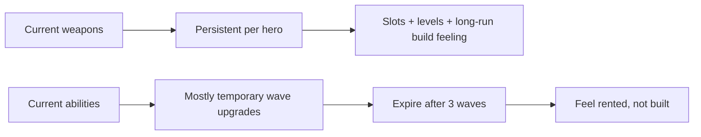
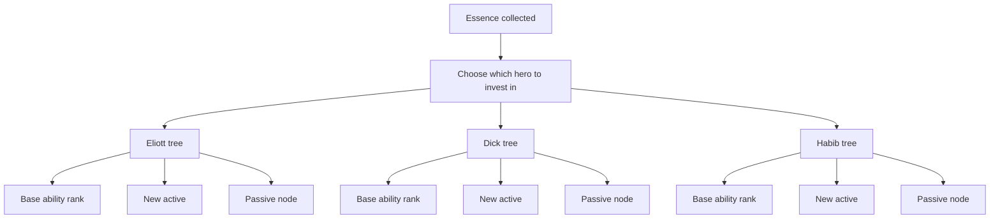
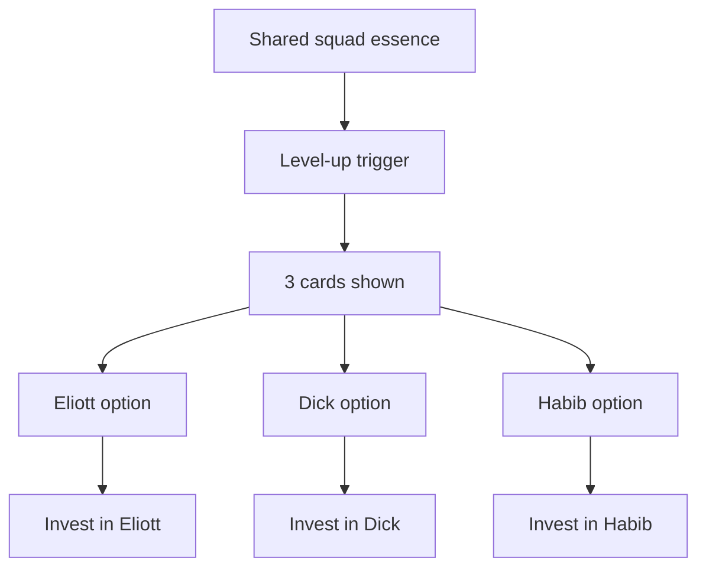
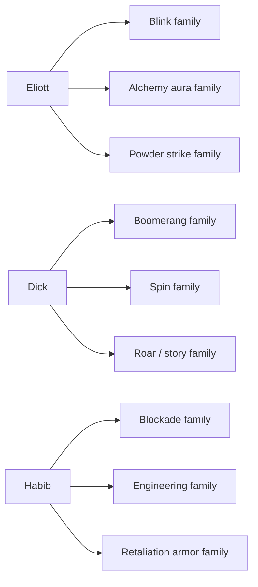
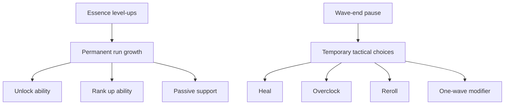
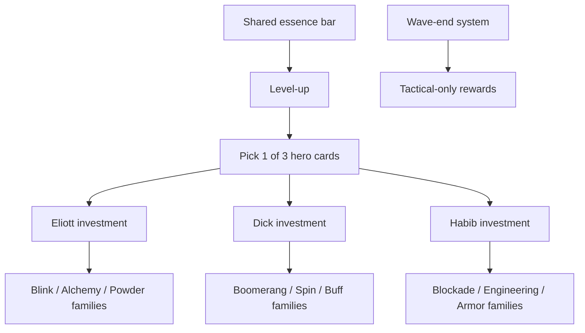
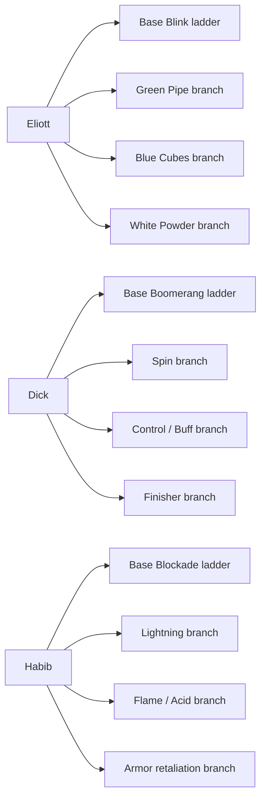
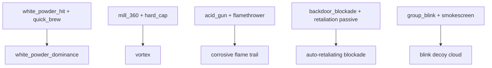
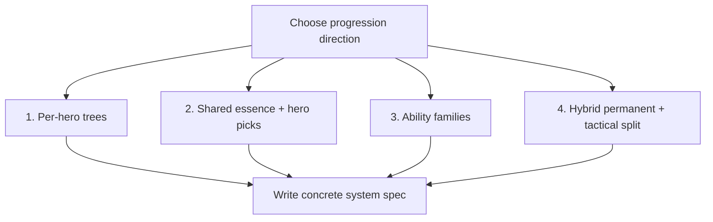

# Ability Progression Brainstorm

Date: 2026-05-17
Status: Discussion only. No implementation decisions yet.

## Problem We Are Solving

Right now abilities and weapons progress in two different ways:

- Weapons already feel persistent: each hero owns their own weapon slots and upgrades them independently.
- Ability upgrades feel temporary: most active skills last 3 waves, then disappear.

That mismatch makes weapons feel like a build, while abilities feel like rented power.

The goal of this brainstorm is to move abilities toward a more sustainable Vampire-Survivors-like progression without losing the identity of a 3-hero squad.

## Current Design Pressure

- There are 3 heroes, so the player cannot reasonably manage a huge active toolkit on each one.
- Base hero abilities are already strong identity pieces:
  - Eliott: `group_blink`
  - Dick: `boomerang`
  - Habib: `backdoor_blockade`
- Upgrade actives already exist and are flavorful, but they are treated more like temporary wave buffs than long-run build pieces.
- Essence already drives player level-ups, so it is the cleanest resource for persistent ability progression too.

## Design Goals

- Make abilities feel earned and persistent during a run.
- Preserve each hero's role instead of turning everyone into the same stat blob.
- Keep the number of player decisions readable despite controlling 3 heroes.
- Allow mix-and-match builds and some synergy, not only flat stat increases.
- Reuse as much of the current content as possible.

## Option 1: Per-Hero Ability Trees

Each hero has their own ability board funded by essence. Essence can be spent on that hero to unlock and level abilities.

### Structure

- Every hero keeps 1 base ability plus up to 2 extra active abilities.
- Each active ability has 3 to 5 ranks.
- Passive upgrades also belong to a hero and permanently support that hero's kit for the run.
- Upgrade choices happen on level-up from essence, not at wave end.

### Example

- Eliott picks `green_pipe` at level 2.
- Later, the same offer appears again and upgrades it to rank 2 instead of giving a duplicate.
- Rank examples:
  - Rank 1: unlock ability
  - Rank 2: lower cooldown
  - Rank 3: bigger radius
  - Rank 4: added rider effect
  - Rank 5: evolution

### Pros

- Cleanest mental model.
- Closest to Vampire Survivors weapon evolution.
- Fits the existing weapon ladder structure.
- Gives each hero a readable build identity.

### Cons

- Can become UI-heavy if all 3 heroes level independently.
- Risk of too many offers if the level-up screen includes every hero at once.

## Option 2: Shared Squad Essence, Hero-Specific Picks

Essence goes into one shared run resource, but every level-up asks the player to choose which hero to invest in.

### Structure

- One shared XP bar stays as-is.
- On level-up, present 3 cards:
  - one Eliott option
  - one Dick option
  - one Habib option
- The selected hero gets either:
  - a new active ability
  - a rank-up for an owned ability
  - a passive support node

### Why This Fits The Current Game

- It keeps the current shared essence system.
- It avoids triple bookkeeping.
- It encourages deliberate squad shaping: one run can become "carry Dick", another can become "support-heavy Eliott + tank Habib".

### Pros

- Best balance between readability and depth.
- Feels fair because every level-up still asks "which hero needs power most?"
- Matches the current squad-control fantasy better than fully separate XP bars.

### Cons

- One hero can snowball if the pool is not curated.
- Needs careful offer rules so weak heroes still get catch-up options.

## Option 3: Ability Families Instead Of Individual Skills

Instead of unlocking many separate actives, each hero has 2 to 3 ability families, and upgrades deepen those families.

### Structure

- Eliott family examples:
  - Blink family
  - Alchemy aura family
  - Powder strike family
- Dick family examples:
  - Boomerang family
  - Spin family
  - Roar/story buff family
- Habib family examples:
  - Blockade family
  - Elemental engineering family
  - Retribution armor family

Each pickup improves one family node rather than adding a brand-new button too often.

### Pros

- Strong identity and lower hotkey overload.
- Easier to balance.
- Easier to present in UI.

### Cons

- Less exciting variety if overdone.
- Some current abilities would need to become branches or modifiers rather than stand-alone actives.

## Option 4: Hybrid Model

Keep wave-end upgrades, but change their role.

### Structure

- Essence level-ups become the main permanent run progression.
- Wave-end rewards become tactical bonuses:
  - free reroll
  - temporary overclock
  - instant heal
  - one-wave enhancement
  - evolution catalyst

In this model, abilities themselves no longer expire after 3 waves. Only tactical modifiers do.

### Pros

- Solves the sustainability problem directly.
- Preserves the wave-break identity already in the game.
- Separates long-term build decisions from short-term survival decisions.

### Cons

- Requires the most system redesign.
- Two progression loops must feel distinct or it becomes noisy.

## Recommended Direction

Recommend: **Option 2 with some Option 3 structure.**

That means:

- Keep one shared essence bar for the whole squad.
- On each level-up, the player chooses which hero to improve.
- Each hero has curated ability families, so not every upgrade is a brand-new skill.
- Wave-end upgrades become lighter tactical choices or reroll-style support, not the main source of lasting build power.

This feels like the best fit for the current game because the player already thinks in terms of a squad, not three isolated RPG characters.

## Proposed Hero Upgrade Ladders

These are draft ladders, not final content.

## Eliott

Role: mobility, team support, alchemy setup.

### Base ability ladder: Group Blink

1. Rank 1: current blink.
2. Rank 2: cooldown reduced.
3. Rank 3: ally pull radius increased.
4. Rank 4: landing zone slows or stuns nearby enemies.
5. Rank 5: blink leaves smoke at origin and grants a short shield after arrival.

### Secondary active families

- `green_pipe`
  - Rank 1: damage reduction aura
  - Rank 2: longer duration
  - Rank 3: radius increase
  - Rank 4: adds brief cleanse or shield
- `blue_cubes`
  - Branch choice: rage or speed
  - Later ranks make the chosen branch stronger
- `white_powder`
  - Rank 1: nearest-enemy strike
  - Rank 2: extra strike or bigger radius
  - Rank 3: chain sequence / dominance evolution

### Passive support nodes

- `extended_formula`
- `quick_brew`
- `residual_haze`
- `smokescreen`
- possible new passive: essence magnet bonus for Eliott

## Dick

Role: carry damage, disruption, melee execution.

### Base ability ladder: Boomerang

1. Rank 1: current throw.
2. Rank 2: wider arc or higher speed.
3. Rank 3: increased outbound/return hits.
4. Rank 4: second boomerang pass or split return.
5. Rank 5: catches trigger a short frenzy buff.

### Secondary active families

- Spin family
  - `mill_360` -> `vortex` as the evolution path
- Control family
  - `scream`
  - upgraded version adds fear, armor break, or longer stun
- Buff family
  - `inappropriate_stories`
  - later ranks improve radius and buff strength
- Finisher family
  - `smashing_time`
  - probably rare/late unlock, not an early pick

### Passive support nodes

- `iron_knuckles`
- `battle_rhythm`
- `hard_cap`
- `thick_skull`
- `thunderfoot`
- possible new passive: boomerang applies bleed

## Habib

Role: defense anchor, reflected damage, area denial.

### Base ability ladder: Backdoor Blockade

1. Rank 1: current damage reduction.
2. Rank 2: longer duration.
3. Rank 3: larger snapshot radius.
4. Rank 4: reflects a portion of blocked damage.
5. Rank 5: allies gain barrier or unstoppable during the first second.

### Secondary active families

- Lightning family
  - `chain_lightning`
  - more bounces, more stun, or fork on kill
- Flame/acid engineering family
  - `flamethrower`
  - `acid_gun`
  - possible evolution if both are owned: corrosive firewall
- Armor retaliation family
  - Fire / Lightning / Spikes become a stackable retaliation package

### Passive support nodes

- `dense_plating`
- `reinforced_frame`
- `engineers_efficiency`
- `weighted_swing`
- armor retaliation passives
- possible new passive: shared armor extends to nearby allies permanently at reduced value

## Evolution Ideas

These are the most Vampire-Survivors-like pieces and could become late-run goals.

- Eliott: `white_powder_hit` + `quick_brew` -> `white_powder_dominance`
- Dick: `mill_360` + `hard_cap` -> `vortex`
- Habib: `acid_gun` + `flamethrower` -> corrosive flame trail
- Habib: `backdoor_blockade` + any retaliation passive -> blockade retaliates automatically
- Eliott: `group_blink` + `smokescreen` -> blink clones / decoy cloud
- Dick: `boomerang` + bleed passive -> orbiting recall blades effect

## Important Decision: Who Owns Active Slot Pressure?

This is the key design fork.

### Version A

- Base ability upgrades do not use active slots.
- Only secondary actives use the 2-slot limit.

This is the safer choice.

### Version B

- Evolved base abilities can partially replace secondary actives.

This is more dramatic, but riskier and harder to teach.

Recommend **Version A** first.

## Suggested Next Step

Before coding, decide one of these:

1. Shared essence with hero-specific level-up choices.
2. Fully separate hero ability trees.
3. Hybrid system where essence handles permanent growth and wave-end upgrades become tactical only.

If we pick one, the next doc should be a concrete rules spec:

- how offers are generated
- how many ranks each ability has
- what counts as an evolution
- whether wave-end upgrades remain in the game
- how the HUD shows per-hero ability progression
